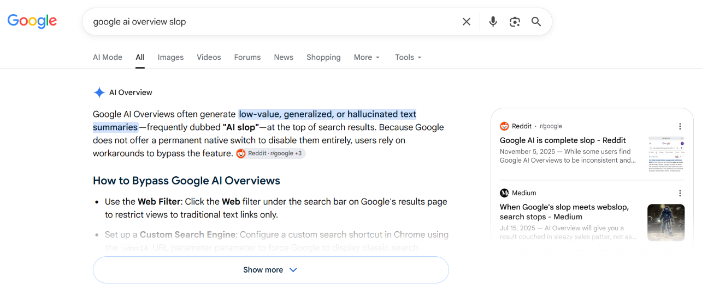

# Google Search Slop Blocker

[uBlock Origin(uBO)](https://github.com/gorhill/ublock) and [uBlock Origin Lite(uBOL)](https://github.com/uBlockOrigin/uBOL-home) filter for blocking _so-called-AI_ features in Google Search.



_Example of the slop_

> LLMs are not AI in the first place. They are just a machine learning model that predicts the next word in a sequence based on the context. They might come in handy when used in the right place and the right way, but Google Search is not.

## What it does

### It blocks...

- "AI Overview" (Both `full` and `lite` versions)
- "People also ask" and "People also search for" (`full` version only)
- "AI Mode" tab (`full` version only)

### It does not block...

- Slop in the actual search results that is all over the place

## How to use

Add the following filter to your uBO/uBOL filter list:

**Full version**

```
https://raw.githubusercontent.com/SalaryTheft/gssb/master/dist/gssb-full.txt
```

**Lite version**

```
https://raw.githubusercontent.com/SalaryTheft/gssb/master/dist/gssb-lite.txt
```

### Custom DNR Rule for iOS Safari

By limitation of iOS Safari, uBOL cannot block XMLHttpRequest(XHR) by default. Adding a filter only hides the DOM element, but the XHR request is still sent and wastes bandwidth (and energy for both your device and the server).

To completely block the request, you need to add a custom DNR rule in uBOL.

> Open uBOL app, go to `Open Safari Extension Settings` > `Settings` > `For Developers` > `Custom DNR Rules`.

```yaml
action:
  type: block
condition:
  urlFilter: ||www.google.com/async/folsrch
  resourceTypes:
    - xmlhttprequest
```

---

#### Disclaimer

"Google" and "Google Search" are trademarks of Google LLC. This project is not affiliated with or endorsed by Google LLC.
